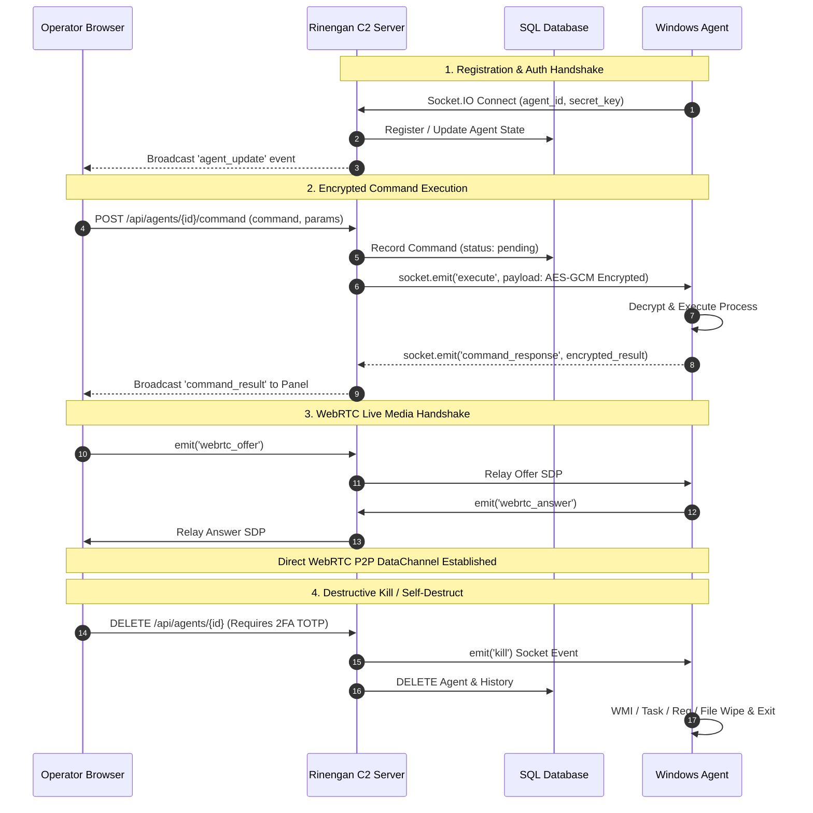

<div align="center">

# ⚡ WHOAMI_404 // RINENGAN C2

[](https://git.io/typing-svg)

<p align="center">
  <a href="https://python.org"></a>
  <a href="https://flask.palletsprojects.com"></a>
  <a href="https://socket.io"></a>
  <a href="https://webrtc.org"></a>
  <a href="https://en.wikipedia.org/wiki/Galois/Counter_Mode"></a>
  <a href="LICENSE"></a>
</p>

[Overview](#-overview) • [Key Features](#-key-features) • [System Architecture](#-system-architecture--workflow) • [API & Socket Reference](#-rest-api--socketio-event-reference) • [Management & Reset Utilities](#-system-management--reset-utilities) • [Quick Start](#-quick-start--installation) • [Agent Build](#-agent-compilation--deployment) • [Cleanup](#-persistence-removal--cleanup-script)

</div>

---

## 📖 Overview

**Rinengan C2** is an enterprise-grade, asynchronous Command and Control telemetry platform engineered for authorized security researchers, red teams, and threat emulation operations. Built with a reactive **Flask-SocketIO** engine and native **WebRTC peer connections**, Rinengan C2 provides real-time desktop monitoring, live audio/video streaming, and stealth persistence management behind a zero-trust multi-factor authenticated control panel.

<br>

<table align="center" width="100%">
  <tr>
    <td align="center" width="33%">
      <br><br>
      <b>⚡ Asynchronous Engine</b><br>
      <sub>Non-blocking WebSocket telemetry with native threading</sub>
    </td>
    <td align="center" width="33%">
      <br><br>
      <b>🔐 Authenticated Crypto</b><br>
      <sub>Per-agent AES-256-GCM payload encryption with 12-byte IVs</sub>
    </td>
    <td align="center" width="33%">
      <br><br>
      <b>🎥 Real-Time Media</b><br>
      <sub>Direct P2P 1080p desktop video, mic loopback & webcam feeds</sub>
    </td>
  </tr>
  <tr>
    <td align="center" width="33%">
      <br><br>
      <b>🛡️ Zero-Trust Access</b><br>
      <sub>Google Authenticator 2FA, session mutex & IP whitelisting</sub>
    </td>
    <td align="center" width="33%">
      <br><br>
      <b>🧹 WMI Self-Destruct</b><br>
      <sub>Automatic cleanup of WMI filters, scheduled tasks & artifacts</sub>
    </td>
    <td align="center" width="33%">
      <br><br>
      <b>🛠️ Management Suite</b><br>
      <sub>Dedicated Python CLI utilities for operator, DB & telemetry wipes</sub>
    </td>
  </tr>
</table>

<br>

---

## ✨ Key Features

<details open>
<summary><b>⚡ 1. Real-Time Telemetry & Encrypted Command Pipeline</b></summary>
<br>

* **Sub-Second Latency:** Bi-directional Socket.IO WebSockets deliver live terminal outputs, system diagnostics, and process updates instantly.
* **AES-256-GCM Encryption:** Every command payload (`uuid`, `command`, `params`) and execution result is encrypted end-to-end using per-agent AES-256-GCM secrets before transmission.
* **Dynamic Heartbeats & Jitter:** Configurable interval timing with random jitter algorithms prevents endpoint behavior profiling.
</details>

<details open>
<summary><b>🎥 2. High-Definition WebRTC Live Media Streaming</b></summary>
<br>

| Stream Type | Description | Controls |
| :--- | :--- | :--- |
| **🖥️ Live Screen** | Peer-to-Peer 1080p Desktop Capture over WebRTC | Quality (10-95%), FPS (1-30), Remote Input Control |
| **📷 Camera Feed** | WebRTC Video Stream from local webcams | Device Switching, Resolution Scaling |
| **🎙️ Live Audio** | Low-latency PCM Audio streaming | Device Selection, Buffer Adjustments |
</details>

<details open>
<summary><b>🔒 3. Hardened Zero-Trust Security Architecture</b></summary>
<br>

* **Google Authenticator (TOTP 2FA):** Destructive actions (`Agent Kill`, `Agent Purge`, `Emergency Global Killswitch`) require 6-digit TOTP validation.
* **Custom Operator Identity:** Setup wizard allows configuring custom operator usernames with seamless authentication.
* **Single-Active Session Tokens:** Active session tokens strictly enforce single-operator logins and automatically invalidate secondary sessions.
* **Rate Limiting & IP Filtering:** `Flask-Limiter` protects login and auth endpoints against brute-force attempts while enforcing remote IP whitelisting.
</details>

<details open>
<summary><b>🧹 4. Complete Agent Self-Destruct & Database Management</b></summary>
<br>

* **WMI & Persistence Removal:** One-click termination triggers full self-destruct routines wiping WMI Subscriptions, Scheduled Tasks, Registry Autorun keys, Defender Exclusions, binaries, and state files.
* **Database Management:** Purges command logs and database records (`db.session.delete(agent)`) and broadcasts `agent_deleted` events across all active panels.
</details>

---

## 🏗️ System Architecture & Workflow



---

## 📡 REST API & Socket.IO Event Reference

### REST Endpoints

| Method | Endpoint | Description | Auth Required |
| :--- | :--- | :--- | :--- |
| `GET/POST` | `/setup` | Initial Operator Account Setup | No (First Time Only) |
| `GET/POST` | `/login` | Operator Authentication (Password + 2FA) | No |
| `GET` | `/logout` | Terminate active operator session | Session Token |
| `GET` | `/panel` | Main operator dashboard interface | Session Token |
| `POST` | `/api/agents/register` | Dynamic agent registration & handshake | Agent Secret / Public |
| `GET` | `/api/agents` | Retrieve all registered agents & status | Session Token |
| `POST` | `/api/agents/<id>/command` | Issue AES-256-GCM Encrypted Command | Session Token |
| `POST` | `/api/agents/<id>/rename` | Update agent display alias | Session Token |
| `DELETE`| `/api/agents/<id>` | Terminate agent & purge database record | Session + 2FA TOTP |
| `POST` | `/api/agents/<id>/persistence` | Deploy persistence module (`task`, `wmi`, `registry`, `startup`) | Session Token |
| `GET` | `/api/webhooks` | Retrieve configured alert webhooks | Session Token |
| `POST` | `/api/webhooks` | Create encrypted Discord webhook | Session Token |
| `DELETE`| `/api/webhooks?id=<id>` | Delete webhook alerting endpoint | Session Token |
| `GET` | `/api/totp/status` | Check TOTP pairing status | Session Token |
| `POST` | `/api/totp/verify-setup` | Confirm initial TOTP pairing code | Session Token |
| `POST` | `/api/totp/verify` | Verify 2FA code for privileged actions | Session Token |
| `POST` | `/api/totp/reset` | Reset TOTP pairing to enroll a new device | Session Token |

### Socket.IO Event Reference

| Event Name | Direction | Payload | Description |
| :--- | :--- | :--- | :--- |
| `connect` | Client ➔ Server | `?agent_id=&secret=` or Session | Authenticates either an agent instance or an operator panel |
| `disconnect` | Client ➔ Server | — | Cleans up socket room; triggers stream shutdown if last operator leaves |
| `heartbeat` | Agent ➔ Server | `{"agent_id": "<id>"}` | Periodic keepalive; server responds with `heartbeat_ack` |
| `agent_info` | Agent ➔ Server | `{"agent_id": "<id>", "info": {...}}` | Reports CPU, GPU, RAM, OS version, and tags |
| `rename_agent`| Panel ➔ Server | `{"agent_id": "<id>", "new_name": "..."}` | Updates display name for an agent |
| `agent_update`| Server ➔ Panel | `Agent` model object | Broadcasts real-time online status and telemetry to panel |
| `agent_deleted`| Server ➔ Panel | `{"agent_id": "<id>"}` | Broadcasts deletion of an agent from the dashboard |
| `execute` | Server ➔ Agent | `{"uuid": "...", "payload": "<AES-GCM>"}` | Delivers encrypted task payload to target agent room |
| `command_response` | Agent ➔ Server | `{"uuid": "...", "result": ..., "error": ...}` | Delivers executed command result back to server |
| `command_result` | Server ➔ Panel | `{"uuid": "...", "result": ..., "command": ...}` | Relays terminal execution output to operator UI |
| `kill` | Server ➔ Agent | `{}` | Instructs agent to trigger full self-destruct routines |
| `webrtc_offer` | Panel ⇄ Agent | SDP offer payload | Signals WebRTC P2P stream initiation |
| `webrtc_answer`| Agent ⇄ Panel | SDP answer payload | Confirms WebRTC P2P connection |
| `webrtc_ice_candidate` | Relay | ICE candidate payload | Relays ICE candidates between browser and target agent |
| `stop_webrtc` | Panel ➔ Server ➔ Agent | `{"agent_id": "<id>", "stream_type": "..."}` | Stops active video, screen, or audio WebRTC tracks |
| `update_stream_params` | Panel ➔ Agent | `{"fps": 15, "quality": 75}` | Dynamically changes screen capture framerate and quality |
| `remote_input`| Panel ➔ Agent | Mouse / Keyboard input events | Sends remote control inputs to the target desktop |

---

## 🛠️ System Management & Reset Utilities

The repository includes three dedicated Python maintenance scripts located in the `scripts/` directory for granular database and credential operations:

### 1. Reset Operator Credentials & 2FA Only (`scripts/reset_user.py`)
Resets or updates operator credentials and clears Google Authenticator 2FA settings without touching agents, commands, or telemetry tables.
```bash
# Reset with custom username and password
python scripts/reset_user.py <username> <password>

# Example:
python scripts/reset_user.py whoami IMF10192006
```
*(Running without arguments defaults to username `admin` and password `admin123`)*

### 2. Reset Database Telemetry Data Only (`scripts/reset_db.py`)
Wipes agent logs, command execution history, webhooks, and keylogs while **preserving** operator user accounts, passwords, and 2FA configurations.
```bash
python scripts/reset_db.py
```

### 3. Full System Reset (`scripts/reset_all.py`)
Performs a complete wipe of all database tables (including operator accounts). Running `python app.py` after executing this script automatically displays the **Initial Setup Wizard (`/setup`)** on launching the control panel.
```bash
python scripts/reset_all.py
```

---

## 🚀 Quick Start & Installation

### 1. Repository Setup
```bash
# Clone the repository
git clone https://github.com/your-org/rinengan-c2.git
cd rinengan-c2

# Install Python dependencies
pip install -r requirements.txt
```

### 2. Environment Configuration
Create a `.env` file in the root directory (or copy and modify `.env`):
```env
PORT=33875
SECRET_KEY=generate_random_secure_key_here
DATABASE_URL=sqlite:///c2.db
IP_WHITELIST=127.0.0.1,192.168.1.0/24
DISCORD_WEBHOOK_URL=
```

### 3. Launching the C2 Server
```bash
python app.py
```
> Access the Control Panel at `http://127.0.0.1:33875`. If configuring a fresh installation, complete the setup wizard at `/setup` to pair your 2FA authenticator app.

---

## 💻 Agent Compilation & Deployment

```bash
# 1. Install agent dependencies
pip install -r agent/requirements.txt

# 2. Configure & test execution in standalone mode
# Edit agent/agent.py (lines 110-111) to set your PANEL_URL and SECRET_KEY:
# PANEL_URL = "http://127.0.0.1:33875"
# SECRET_KEY = "YourSharedSecretKey"
python agent/agent.py

# 3. Build standalone EXE using PyInstaller
cd agent
pyinstaller agent.spec
```
> The compiled standalone executable will be generated at `agent/dist/SecurityHealthService.exe`.

---

## 🧼 Persistence Removal & Cleanup Script

To deploy or remove agent persistence mechanisms on a test target:

### 1. Watchdog Installer (WMI Persistence)
```powershell
# Run as Administrator in PowerShell
powershell -EP Bypass -File agent\watchdog\watchdog.ps1
```

### 2. Manual Persistence Removal & Cleanup
To completely clean up agent persistence mechanisms and state files:

```cmd
# Run as Administrator in Command Prompt from agent\persistnce_remover
cd agent\persistnce_remover
remove_persistence.bat
```

This automated script performs:
1. Process termination (`securityhealthservice.exe`, `securityhelper.exe`, `scrcons.exe`, watchdog instances).
2. Scheduled Task deletion (`Microsoft Security Health Service`, `HealthServiceRecovery`, `SecurityHealthService`, `SecurityHealthHelper`).
3. Registry Autorun removal (`HKCU` & `HKLM` Run keys).
4. Windows Defender exclusion reversal (`Remove-MpPreference`).
5. WMI Filter, Consumer, Binding, and Timer cleanup via PowerShell CIM instances.
6. Reparse point / junction unhooking (`GhostRoot\A`, `GhostRoot\B`).
7. Complete file & log wipe (`/A /F /Q` forced deletion of all state/temp files).

---

## ⚠️ Legal & Security Disclaimer

> **IMPORTANT NOTICE:** This software is designed strictly for **authorized security research, red team emulations, and defense validation**. Deployment of this tool against targets without prior written authorization from system owners is strictly prohibited and violates national and international cybercrime laws. The authors accept no responsibility or liability for unauthorized usage or damage.

---

<div align="center">

Distributed under the **MIT License**. See [`LICENSE`](LICENSE) for details.

**WHOAMI_404 // RINENGAN C2 FRAMEWORK**

</div>
